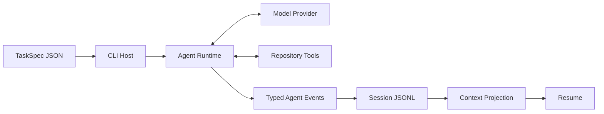

# CodeL

CodeL 是一个使用 TypeScript 构建的 Coding Agent CLI。它把模型调用、工具执行、运行时状态和会话持久化拆成独立模块，既可以连接 DeepSeek 或其他 OpenAI-compatible API，也可以使用可重复的 Scripted Provider 进行离线开发与测试。

项目目前提供：

- 严格校验的 `TaskSpec` 任务输入；
- 带步骤数、工具调用数和 Token 用量约束的 Agent Runtime；
- 仓库浏览、检索、读取、补丁修改和 Diff 工具；
- OpenAI-compatible 流式模型适配器与确定性 Scripted Provider；
- 基于 JSONL 的会话记录，以及 Resume、Rewind 和 Fork；
- 保留 Canonical Transcript 的可审计 Full Context Compaction；
- 完整的 TypeScript 类型检查、单元测试和集成测试。

## 环境要求

- Node.js 22.12 或更高版本；
- pnpm 10.x（仓库锁定为 pnpm 10.25.0）。

## 安装与构建

```bash
git clone https://github.com/SkyNet-T-800/CodeL.git
cd CodeL

corepack enable
corepack prepare pnpm@10.25.0 --activate
pnpm install --frozen-lockfile
pnpm build
```

构建完成后，可以从仓库根目录通过 `pnpm exec codel` 启动 CLI：

```bash
pnpm exec codel
```

CLI 会打印可用命令和参数说明。

## 使用 DeepSeek 运行

DeepSeek Provider 默认连接 `https://api.deepseek.com`，默认模型为 `deepseek-v4-flash`。先在当前 Shell 中设置 API Key，再运行仓库自带的示例任务：

```bash
export DEEPSEEK_API_KEY="your-api-key"

pnpm exec codel run \
  --provider deepseek \
  --task fixtures/hello-repo/task.json \
  --sessions-dir .sessions \
  --session-id quickstart
```

会话会保存为 `.sessions/quickstart.jsonl`。使用完成后可以从当前 Shell 移除 Key：

```bash
unset DEEPSEEK_API_KEY
```

可选的 DeepSeek 配置如下：

| 环境变量 | 作用 | 默认值 |
| --- | --- | --- |
| `DEEPSEEK_API_KEY` | DeepSeek API Key | 回退到 `REPO_CIRCUIT_API_KEY` |
| `DEEPSEEK_BASE_URL` | API 地址 | `https://api.deepseek.com` |
| `DEEPSEEK_MODEL` | 模型 ID | `deepseek-v4-flash` |
| `DEEPSEEK_PROVIDER_NAME` | 写入运行元数据的 Provider 名称 | `deepseek` |
| `DEEPSEEK_MODEL_REVISION` | 可选的模型修订标识 | 未设置 |

DeepSeek 默认启用思考模式。可以通过以下变量调整推理行为：

```bash
export REPO_CIRCUIT_REASONING_EFFORT=low  # low、high 或 max
export REPO_CIRCUIT_THINKING=enabled      # enabled 或 disabled
```

关闭 DeepSeek 思考模式后，可以使用 `REPO_CIRCUIT_TEMPERATURE` 设置 0 到 2 之间的温度。思考模式开启时不能设置温度；思考模式关闭时不能设置 reasoning effort。

> 不要把真实 API Key 写入任务文件、源码或提交到 Git。CodeL 不会自动读取 `.env`；生产环境建议通过 Shell、CI Secret 或密钥管理服务注入。

## 使用其他 OpenAI-compatible API

`openai` Provider 可以连接任何实现了 OpenAI-compatible Chat Completions 流式协议的服务：

```bash
export REPO_CIRCUIT_API_KEY="your-api-key"
export REPO_CIRCUIT_BASE_URL="https://api.example.com/v1"
export REPO_CIRCUIT_MODEL="your-model-id"

pnpm exec codel run \
  --provider openai \
  --task fixtures/hello-repo/task.json \
  --sessions-dir .sessions
```

还可以设置 `REPO_CIRCUIT_PROVIDER_NAME`、`REPO_CIRCUIT_MODEL_REVISION` 和 `REPO_CIRCUIT_TEMPERATURE`。服务端必须兼容项目当前使用的流式响应和工具调用格式。

## TaskSpec

每次运行都从一个 JSON 任务文件开始：

```json
{
  "schemaVersion": 1,
  "id": "fixture-readme",
  "title": "Read the fixture README",
  "instruction": "Read README.md and report the fixture project name.",
  "workspace": { "root": "." },
  "constraints": { "allowedTools": ["read_file"] },
  "budget": { "maxSteps": 4 }
}
```

- `workspace.root` 相对于 TaskSpec 文件所在目录解析，并且不能逃逸该目录；
- `constraints.allowedTools` 决定本次任务可以暴露给模型的工具；
- `budget.maxSteps` 限制一次运行最多执行多少个 Agent Step；
- `--max-steps` 可以在命令行中进一步覆盖步骤上限。

CLI 当前注册的静态仓库工具包括 `tree`、`symbols`、`read`、`read_file`、`grep`、`apply_patch` 和 `diff`。只有同时注册且被 TaskSpec 允许的工具才会提供给模型。

## CLI

### 启动任务

```text
codel run --task <task.json> [--provider scripted|openai|deepseek]
  [--run-id <id>] [--workspace <workspace>]
  [--script <script.json>] [--max-steps <n>]
  [--sessions-dir <directory>] [--session-id <id>]
  [--resume-session <id> [--at-step <completed-step>]]
```

- `--provider scripted` 使用脚本化响应，适合不访问网络的测试；
- `--workspace` 覆盖 TaskSpec 中的工作区路径；
- `--session-id` 创建指定 ID 的新会话；
- `--resume-session` 在已有会话的安全状态上继续运行；
- `--resume-session <id> --at-step <n>` 从指定的已完成 Step 继续，并在同一个 JSONL 中形成新分支。

### 管理会话

```bash
pnpm exec codel session list --sessions-dir .sessions
pnpm exec codel session show --session-id quickstart --sessions-dir .sessions
pnpm exec codel session resume --session-id quickstart --sessions-dir .sessions
pnpm exec codel session rewind --session-id quickstart --at-step 1 --sessions-dir .sessions
pnpm exec codel session fork --session-id quickstart --at-step 1 \
  --child-session-id quickstart-fork --sessions-dir .sessions
```

每个会话对应一个 `<session-id>.jsonl` 文件。每一行都是一条带 `uuid`、`parentUuid`、`sessionId`、`cwd` 和时间戳的 Agent Event：

- Resume 从当前活动分支重建消息、用量、工具调用和运行状态；
- Rewind 选择某个已完成 Step 对应的对话状态，后续事件仍追加到原文件，旧分支不会被删除；
- Fork 将选中的活动链复制成一个可独立 Resume 的新会话文件；
- `session resume` 和 `session rewind` 只检查并输出恢复准备结果；要真正继续执行，请使用 `codel run --resume-session ...`；
- 当前 Rewind 只处理会话状态，不恢复工作区文件。执行前请自行使用 Git 或其他快照机制保护文件修改。

### 压缩上下文

对已结束且没有悬空 Tool Call 的会话，可以直接提交一份已审阅摘要：

```bash
pnpm exec codel compact \
  --session-id quickstart \
  --sessions-dir .sessions \
  --summary "已完成仓库检查；下一步运行验证并处理失败。"
```

也可以复用模型 Provider 生成摘要：

```bash
pnpm exec codel compact \
  --session-id quickstart \
  --sessions-dir .sessions \
  --task fixtures/hello-repo/task.json \
  --provider deepseek
```

`codel session compact ...` 是同一命令的别名。成功后，CLI 只在原 JSONL 末尾追加一条 `context.compacted` checkpoint；旧事件和分支不会被删除或改写。后续 Resume 从 checkpoint 恢复模型可见消息，并继续回放 checkpoint 之后的新事件。

每次 checkpoint 都带 `ContextSelectionManifest`，记录策略版本、来源 head、included/dropped event ID、预算、Token 估算和来源 Hash。当前首版只实现手动 Full Compaction，不包含自动阈值压缩、Memory、Embedding 或向量检索。

## 架构



CodeL 使用 pnpm workspace 管理多个边界清晰的模块：

```text
apps/cli/             CLI 参数、配置加载和依赖组装
packages/core/        TaskSpec、领域契约、Agent Runtime 和事件协议
packages/context/     纯 ContextStrategy、Full Compaction 与 Selection Manifest
packages/providers/   Scripted 与 OpenAI-compatible Provider
packages/tools/       路径安全的仓库读取、检索和修改工具
packages/session/     JSONL 会话、投影、Resume、Rewind 与 Fork
tests/                单元测试和跨模块集成测试
fixtures/             可重复运行的示例工作区与任务
benchmarks/           CLI smoke 场景
```

依赖方向保持为 `apps/cli → context/core/providers/tools/session`、`session → context → core`，其余 workspace 包只通过 `core` 共享领域契约。更完整的模块职责、数据流和开发约束见 [AGENTS.md](AGENTS.md)。

## 开发

```bash
pnpm dev -- run --provider scripted --task <task.json> --script <script.json>
pnpm typecheck
pnpm test
pnpm build
pnpm verify
```

`pnpm verify` 会依次执行严格类型检查、全量测试和构建。提交代码前建议至少运行该命令。

## License

[MIT](LICENSE) © 2026 CodeL contributors
