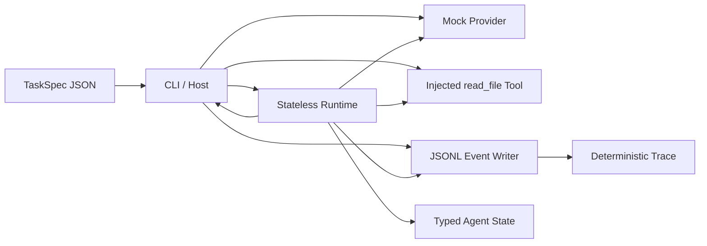

# RepoCircuit · Week 1 Runtime Skeleton

这是 Coding Agent 第 1 周的**参考实现**：在不连接真实模型、不使用 API Key 的前提下，用确定性的 Mock Provider 跑通一次完整的 Agent Run，并输出可逐行解析、可重复比对的 JSONL Trace。

它不是唯一正确答案，但覆盖了本周计划的全部硬性验收项。

## 当前能做什么

一次演示 Run 会严格经过：

```text
TaskSpec → Mock Provider(tool_use) → read_file → Tool Result 回填
         → Mock Provider(end_turn) → completed → JSONL Trace
```

本版本刻意**不做**真实模型、Session、数据库、UI、Docker Sandbox、写文件工具和网络访问。这些都不是 W1 的范围。

## 环境

- Node.js 22.12+（CI 和 `.nvmrc` 使用最新 Node 22）
- pnpm 10.25.0

```bash
corepack enable
corepack prepare pnpm@10.25.0 --activate
pnpm install --frozen-lockfile
```

## 一条命令验收

```bash
pnpm verify
```

它会依次执行：严格类型检查、7 个测试、TypeScript 构建、构建后 CLI Smoke Run、实际 Trace 与 golden Trace 的逐字节比较。

预期末尾输出：

```text
✓ Run fixture-readme-run completed in 2 steps
Trace: .traces/fixture-run.jsonl
Final: Fixture README read successfully: RepoCircuit Fixture.
✓ Trace matches golden fixture (9 events)
✓ Final state matches golden fixture
```

## 单独运行 CLI

```bash
pnpm build
pnpm exec repo-circuit run \
  --task fixtures/hello-repo/task.json \
  --trace .traces/fixture-run.jsonl \
  --run-id fixture-readme-run
```

Trace 位于 `.traces/fixture-run.jsonl`。每个物理行都是一个完整 JSON 对象，最后一行也以换行结尾。

## 架构



依赖方向的关键规则：Runtime 只依赖窄契约，不 import CLI、Session、数据库或 UI。CLI 是 Host，负责读取 TaskSpec、解析工作区路径并注入 Provider、Tool 和 EventSink。

更详细的边界图见 [docs/architecture.md](docs/architecture.md)，决策理由见 [RFC-001](docs/rfcs/RFC-001-runtime-design.md)。

## Monorepo 目录

```text
apps/
  cli/                 # Host：参数、TaskSpec 文件、依赖组装、退出码
packages/
  core/                # 契约、TaskSpec 校验、无 Session 的 Runtime
  providers/           # 两段式 Scripted Mock Provider
  tools/               # 注入式 read_file 演示工具
  trace/               # JSONL EventSink
fixtures/
  hello-repo/          # 第一个 Fixture Repo、任务和 golden 结果
docs/
  rfcs/                # Runtime 设计决策
tests/                 # Runtime、确定性、预算、TaskSpec、JSONL 测试
```

所有内部包都通过 `workspace:*` 声明依赖；构建后的 CLI 使用各包的 `dist`，不依赖本机全局 TypeScript 或未提交产物。

## TaskSpec v1

```json
{
  "schemaVersion": 1,
  "id": "fixture-readme",
  "title": "Read the fixture README",
  "instruction": "Read README.md and report the fixture project name.",
  "workspace": { "root": "." },
  "constraints": { "allowedTools": ["read_file"] },
  "budget": { "maxSteps": 4 }
}
```

外部 JSON 先经过运行时校验，不能只依赖 TypeScript interface。`workspace.root` 必须是相对于 `task.json` 的路径并留在该目录内，因此整个仓库移动到任意绝对路径后仍能运行。

## Trace 不变量

Fixture 的事件类型顺序固定为：

```text
run.begin
step.begin
tool.call
tool.result
step.end      reason=tool_use
step.begin
assistant.final
step.end      reason=end_turn
run.end
```

- `seq` 从 1 连续递增。
- 固定输入、Mock 脚本和 `runId` 得到逐字节相同的 Trace。
- W1 不记录墙上时钟，避免 golden fixture 因时间变化失效。
- `tool_use` 只结束当前 Step；Tool Result 回填并再次调用 Provider 后，Run 才能完成。
- EventSink 写入失败时不能宣称 Run 已完成。

## 开发命令

```bash
pnpm typecheck       # strict TypeScript，不输出文件
pnpm test            # 单元与集成测试
pnpm build           # project references 构建所有 workspace 包
pnpm dev -- run ...  # 可选：直接运行 TypeScript 源码进行开发
pnpm smoke:w1        # 启动构建后的 CLI，生成真实 Trace
pnpm trace:check     # 与 committed golden Trace 逐字节比较
pnpm verify          # CI 使用的完整门禁
```

## W1 验收对应关系

| 计划要求 | 本仓库证据 |
| --- | --- |
| pnpm monorepo | 1 个 app + 4 个 packages，内部依赖为 `workspace:*` |
| CLI / TaskSpec | 构建后的 `apps/cli/dist/index.js` 读取并校验 JSON |
| Mock Provider | 第一次 `tool_use`，第二次 `end_turn`；测试断言调用恰好两次 |
| Typed Agent State | `running / completed / failed` 判别联合类型 |
| JSONL Event Writer | 每事件一行、写入 await、退出前 close |
| README v0 / 架构图 / RFC | 当前文件、Mermaid、RFC-001 |
| Fixture Repo | `fixtures/hello-repo` |
| CI 干净环境 | `.github/workflows/ci.yml` 使用 frozen lockfile 跑 `pnpm verify` |

## Clean-room 声明

这是一个全新、最小、独立的教学仓库。它没有复制任何公司代码、内部 Prompt、Agent 配置、私有测试数据或凭据。
